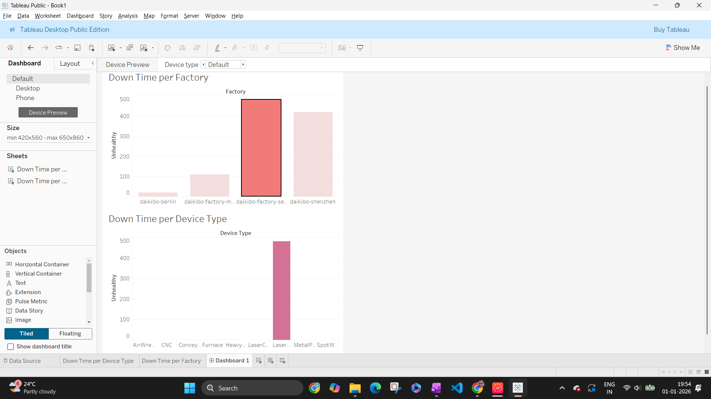

# Factory Downtime Analysis Dashboard

## Project Overview
This project utilizes **Tableau** to analyze telemetry data from manufacturing factories ("Daikibo"). The goal was to visualize potential downtime caused by devices reporting an "unhealthy" status and to identify which factories and device types are facing the most significant operational challenges.

## Tools Used
* **Tableau Desktop / Public** (for data visualization)
* **JSON Data Source** (`daikibo-telemetry-data.json`)

## Methodology

### 1. Data Preparation
* Imported the `daikibo-telemetry-data.json` file into Tableau.
* Created a specific measure to quantify downtime based on device status.

### 2. Calculated Measure
To estimate the impact of device errors, a calculated field named **"Unhealthy"** was created. This field assigns a value of **10 minutes** of potential downtime for every record where the status is "unhealthy".

**Formula:**
```tableau
IF [Status] = 'unhealthy' THEN 10 ELSE 0 END
```
### 3. Visualizations Created
* **Down Time per Factory:** A bar chart comparing total downtime minutes across different factory locations (Berlin, Shenzhen, etc.).
* **Down Time per Device Type:** A bar chart breaking down downtime by specific machinery (e.g., Laser Cutters, CNC machines).

### 4. Interactive Dashboard
* Combined both sheets into a single interactive dashboard.
* **Filter Action:** Configured the "Down Time per Factory" chart to act as a filter. Clicking on a specific factory bar updates the "Down Time per Device Type" chart to show data relevant only to that location.

## Key Insights
* The dashboard allows for quick identification of the factory with the highest downtime.
* By drilling down (clicking on the factory with the most downtime), we can pinpoint exactly which device types are contributing to the failure rates in that specific location.

## Screenshot



  
